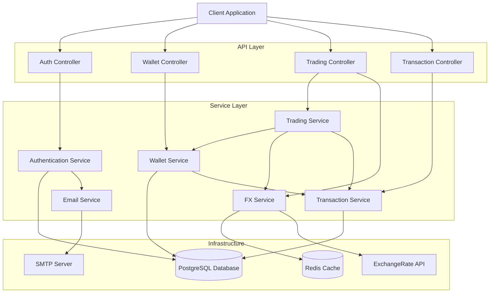
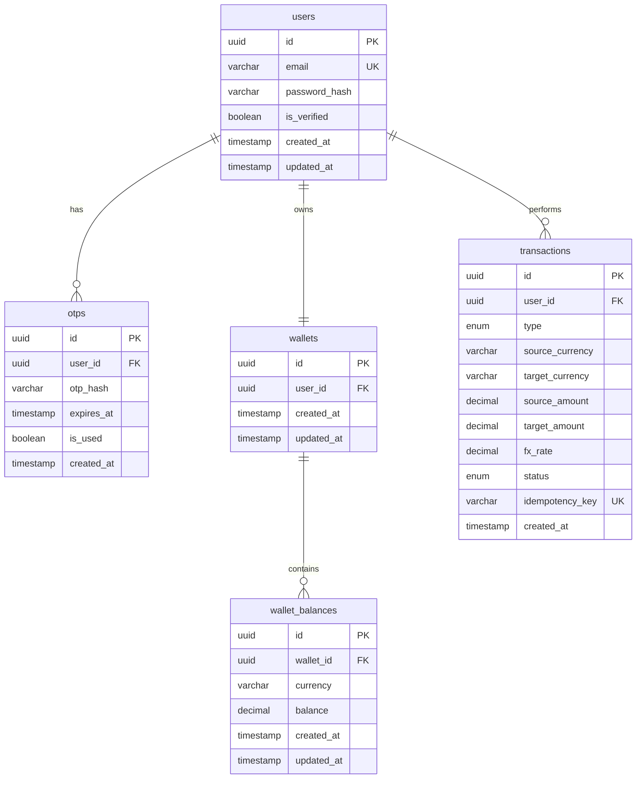

# Design Document: FX Trading Backend

## Overview

The FX Trading Backend is a NestJS-based REST API that provides secure multi-currency wallet management and foreign exchange trading capabilities. The system enables users to register, verify their identity via email OTP, manage wallets across seven supported currencies (NGN, USD, EUR, GBP, CAD, AUD, JPY), and execute currency conversions using real-time exchange rates.

The architecture follows a layered service-oriented design with clear separation of concerns:
- **Authentication Layer**: Handles user registration, email verification, and JWT-based authentication
- **Wallet Management Layer**: Manages multi-currency balances with atomic operations
- **FX Integration Layer**: Fetches and caches real-time exchange rates from external APIs
- **Trading Layer**: Executes currency conversions with transactional integrity
- **Transaction Layer**: Records and retrieves comprehensive transaction history

Key design principles:
- **Atomicity**: All financial operations use database transactions with pessimistic locking
- **Idempotency**: Duplicate requests are safely handled using idempotency keys
- **Security**: JWT authentication, bcrypt password hashing, rate limiting, and input validation
- **Reliability**: Retry mechanisms for external API calls, comprehensive error handling
- **Performance**: Redis caching for FX rates, database indexing, pagination for large datasets

## Architecture

### System Architecture Diagram



### Technology Stack

- **Framework**: NestJS (Node.js/TypeScript)
- **Database**: PostgreSQL 14+ with TypeORM
- **Cache**: Redis 6+
- **Authentication**: JWT (jsonwebtoken, passport-jwt)
- **Password Hashing**: bcrypt
- **Validation**: class-validator, class-transformer
- **Email**: nodemailer with SMTP
- **API Documentation**: Swagger (NestJS OpenAPI)
- **Rate Limiting**: @nestjs/throttler
- **Security**: helmet, cors

### Deployment Architecture

The application follows a standard three-tier architecture:
1. **Presentation Tier**: REST API endpoints with Swagger documentation
2. **Business Logic Tier**: Service layer with domain logic
3. **Data Tier**: PostgreSQL for persistent storage, Redis for caching

## Components and Interfaces

### Authentication Service

**Responsibilities**:
- User registration with email/password
- OTP generation and verification
- JWT token generation and validation
- Password hashing and verification

**Interface**:
```typescript
interface IAuthenticationService {
  register(email: string, password: string): Promise<{ userId: string; message: string }>;
  verifyEmail(userId: string, otp: string): Promise<{ success: boolean }>;
  login(email: string, password: string): Promise<{ accessToken: string; refreshToken: string }>;
  refreshToken(refreshToken: string): Promise<{ accessToken: string }>;
  resendOTP(userId: string): Promise<{ message: string }>;
  validateToken(token: string): Promise<{ userId: string; email: string }>;
}
```

**Key Methods**:
- `register()`: Creates user, generates OTP, sends verification email, creates wallet with 1000 NGN
- `verifyEmail()`: Validates OTP, marks user as verified, invalidates OTP
- `login()`: Validates credentials, checks verification status, generates JWT tokens
- `refreshToken()`: Validates refresh token, generates new access token
- `resendOTP()`: Invalidates old OTPs, generates new OTP, sends email

**Dependencies**: UserRepository, OTPRepository, WalletService, EmailService

### Wallet Service

**Responsibilities**:
- Multi-currency wallet balance management
- Wallet funding operations
- Balance queries with currency filtering
- Pessimistic locking for concurrent operations

**Interface**:
```typescript
interface IWalletService {
  createWallet(userId: string): Promise<{ walletId: string }>;
  getBalances(userId: string): Promise<WalletBalance[]>;
  fundWallet(userId: string, amount: number, idempotencyKey: string): Promise<Transaction>;
  updateBalance(walletId: string, currency: string, amount: number, operation: 'ADD' | 'SUBTRACT'): Promise<void>;
  getBalance(walletId: string, currency: string): Promise<number>;
  hasBalance(walletId: string, currency: string, amount: number): Promise<boolean>;
}
```

**Key Methods**:
- `createWallet()`: Creates wallet and initial NGN balance of 1000.000000
- `getBalances()`: Returns all currency balances for user's wallet
- `fundWallet()`: Adds NGN to wallet with idempotency check, creates transaction record
- `updateBalance()`: Updates balance with pessimistic locking (SELECT FOR UPDATE)
- `hasBalance()`: Checks if sufficient balance exists for operation

**Dependencies**: WalletRepository, WalletBalanceRepository, TransactionService

### FX Service

**Responsibilities**:
- Fetch real-time exchange rates from external API
- Cache rates in Redis with 5-minute TTL
- Retry logic for API failures
- Rate validation and timestamp tracking

**Interface**:
```typescript
interface IFXService {
  getRate(fromCurrency: string, toCurrency: string): Promise<number>;
  getAllRates(): Promise<Map<string, Map<string, number>>>;
  refreshRates(): Promise<void>;
  getCachedRate(fromCurrency: string, toCurrency: string): Promise<number | null>;
}
```

**Key Methods**:
- `getRate()`: Returns exchange rate, fetches from cache or API
- `getAllRates()`: Fetches all supported currency pair rates
- `refreshRates()`: Forces cache refresh from external API
- `getCachedRate()`: Returns rate from cache only, null if not cached

**External API Integration**:
- Provider: exchangerate-api.com
- Endpoint: `https://api.exchangerate-api.com/v4/latest/{baseCurrency}`
- Retry: 3 attempts with exponential backoff (1s, 2s, 4s)
- Timeout: 5 seconds per request

**Dependencies**: Redis, HttpService (Axios)

### Trading Service

**Responsibilities**:
- Execute currency conversions and trades
- Calculate target amounts using FX rates
- Ensure atomic balance updates
- Idempotency handling for duplicate requests

**Interface**:
```typescript
interface ITradingService {
  convertCurrency(
    userId: string,
    sourceCurrency: string,
    targetCurrency: string,
    sourceAmount: number,
    idempotencyKey: string
  ): Promise<ConversionResult>;
  
  trade(
    userId: string,
    fromCurrency: string,
    toCurrency: string,
    amount: number,
    idempotencyKey: string
  ): Promise<TradeResult>;
}

interface ConversionResult {
  transactionId: string;
  sourceCurrency: string;
  targetCurrency: string;
  sourceAmount: number;
  targetAmount: number;
  fxRate: number;
  timestamp: Date;
}
```

**Key Methods**:
- `convertCurrency()`: Converts between any two supported currencies
- `trade()`: Alias for convertCurrency with identical logic

**Conversion Algorithm**:
1. Check idempotency key for duplicate request
2. Fetch current FX rate from FXService
3. Calculate target amount: `targetAmount = sourceAmount * fxRate`
4. Start database transaction
5. Lock source and target wallet balances (SELECT FOR UPDATE)
6. Verify sufficient source balance
7. Subtract from source balance
8. Add to target balance
9. Create transaction record
10. Commit transaction

**Dependencies**: WalletService, FXService, TransactionService, IdempotencyRepository

### Transaction Service

**Responsibilities**:
- Record all wallet activities (funding, conversions, trades)
- Query transaction history with filtering and pagination
- Store idempotency keys with transaction results

**Interface**:
```typescript
interface ITransactionService {
  createTransaction(data: CreateTransactionDto): Promise<Transaction>;
  getTransactionHistory(
    userId: string,
    filters: TransactionFilters,
    pagination: PaginationDto
  ): Promise<PaginatedResult<Transaction>>;
  getTransactionById(transactionId: string, userId: string): Promise<Transaction>;
  storeIdempotencyResult(key: string, result: any, ttl: number): Promise<void>;
  getIdempotencyResult(key: string): Promise<any | null>;
}

interface TransactionFilters {
  type?: 'FUNDING' | 'CONVERSION' | 'TRADE';
  currency?: string;
  startDate?: Date;
  endDate?: Date;
}

interface PaginationDto {
  page: number;
  limit: number;
}
```

**Key Methods**:
- `createTransaction()`: Creates transaction record with all details
- `getTransactionHistory()`: Returns paginated, filtered transaction list
- `storeIdempotencyResult()`: Caches transaction result in Redis for 24 hours
- `getIdempotencyResult()`: Retrieves cached result for duplicate request

**Dependencies**: TransactionRepository, Redis

### Email Service

**Responsibilities**:
- Send OTP verification emails
- Retry failed email sends
- Template-based email formatting

**Interface**:
```typescript
interface IEmailService {
  sendOTP(email: string, otp: string): Promise<void>;
  sendWelcomeEmail(email: string): Promise<void>;
}
```

**Key Methods**:
- `sendOTP()`: Sends OTP email with retry logic (2 retries, 5s delay)
- `sendWelcomeEmail()`: Sends welcome email after verification

**Configuration**:
- Protocol: SMTP
- Retry: 2 attempts with 5-second delay
- Timeout: 10 seconds per attempt
- Templates: HTML-based with dynamic OTP injection

**Dependencies**: nodemailer, SMTP server configuration

## Data Models

### Database Schema



### Entity Definitions

#### User Entity

```typescript
@Entity('users')
export class User {
  @PrimaryGeneratedColumn('uuid')
  id: string;

  @Column({ unique: true, length: 255 })
  email: string;

  @Column({ name: 'password_hash', length: 255 })
  passwordHash: string;

  @Column({ name: 'is_verified', default: false })
  isVerified: boolean;

  @CreateDateColumn({ name: 'created_at' })
  createdAt: Date;

  @UpdateDateColumn({ name: 'updated_at' })
  updatedAt: Date;

  @OneToMany(() => OTP, otp => otp.user)
  otps: OTP[];

  @OneToOne(() => Wallet, wallet => wallet.user)
  wallet: Wallet;

  @OneToMany(() => Transaction, transaction => transaction.user)
  transactions: Transaction[];
}
```

**Constraints**:
- `email`: UNIQUE, NOT NULL, RFC 5322 format validation
- `password_hash`: NOT NULL, bcrypt hash with cost factor 10
- `is_verified`: DEFAULT false

#### OTP Entity

```typescript
@Entity('otps')
export class OTP {
  @PrimaryGeneratedColumn('uuid')
  id: string;

  @Column({ name: 'user_id', type: 'uuid' })
  userId: string;

  @Column({ name: 'otp_hash', length: 255 })
  otpHash: string;

  @Column({ name: 'expires_at', type: 'timestamp' })
  expiresAt: Date;

  @Column({ name: 'is_used', default: false })
  isUsed: boolean;

  @CreateDateColumn({ name: 'created_at' })
  createdAt: Date;

  @ManyToOne(() => User, user => user.otps, { onDelete: 'CASCADE' })
  @JoinColumn({ name: 'user_id' })
  user: User;
}
```

**Constraints**:
- `user_id`: FOREIGN KEY references users(id) ON DELETE CASCADE
- `otp_hash`: NOT NULL, bcrypt hash of 6-digit OTP
- `expires_at`: NOT NULL, 10 minutes from creation
- `is_used`: DEFAULT false

#### Wallet Entity

```typescript
@Entity('wallets')
export class Wallet {
  @PrimaryGeneratedColumn('uuid')
  id: string;

  @Column({ name: 'user_id', type: 'uuid', unique: true })
  userId: string;

  @CreateDateColumn({ name: 'created_at' })
  createdAt: Date;

  @UpdateDateColumn({ name: 'updated_at' })
  updatedAt: Date;

  @OneToOne(() => User, user => user.wallet, { onDelete: 'CASCADE' })
  @JoinColumn({ name: 'user_id' })
  user: User;

  @OneToMany(() => WalletBalance, balance => balance.wallet)
  balances: WalletBalance[];
}
```

**Constraints**:
- `user_id`: FOREIGN KEY references users(id) ON DELETE CASCADE, UNIQUE

#### WalletBalance Entity

```typescript
@Entity('wallet_balances')
@Index(['wallet_id', 'currency'], { unique: true })
export class WalletBalance {
  @PrimaryGeneratedColumn('uuid')
  id: string;

  @Column({ name: 'wallet_id', type: 'uuid' })
  walletId: string;

  @Column({ length: 3 })
  currency: string;

  @Column({ type: 'decimal', precision: 18, scale: 6, default: 0 })
  @Check('balance >= 0')
  balance: number;

  @CreateDateColumn({ name: 'created_at' })
  createdAt: Date;

  @UpdateDateColumn({ name: 'updated_at' })
  updatedAt: Date;

  @ManyToOne(() => Wallet, wallet => wallet.balances, { onDelete: 'CASCADE' })
  @JoinColumn({ name: 'wallet_id' })
  wallet: Wallet;
}
```

**Constraints**:
- `wallet_id`: FOREIGN KEY references wallets(id) ON DELETE CASCADE
- `currency`: NOT NULL, 3 uppercase letters (NGN, USD, EUR, GBP, CAD, AUD, JPY)
- `balance`: DECIMAL(18,6), CHECK (balance >= 0), DEFAULT 0
- UNIQUE INDEX on (wallet_id, currency)

#### Transaction Entity

```typescript
@Entity('transactions')
export class Transaction {
  @PrimaryGeneratedColumn('uuid')
  id: string;

  @Column({ name: 'user_id', type: 'uuid' })
  userId: string;

  @Column({ type: 'enum', enum: ['FUNDING', 'CONVERSION', 'TRADE'] })
  type: 'FUNDING' | 'CONVERSION' | 'TRADE';

  @Column({ name: 'source_currency', length: 3, nullable: true })
  sourceCurrency: string;

  @Column({ name: 'target_currency', length: 3, nullable: true })
  targetCurrency: string;

  @Column({ name: 'source_amount', type: 'decimal', precision: 18, scale: 6, nullable: true })
  sourceAmount: number;

  @Column({ name: 'target_amount', type: 'decimal', precision: 18, scale: 6, nullable: true })
  targetAmount: number;

  @Column({ name: 'fx_rate', type: 'decimal', precision: 18, scale: 6, nullable: true })
  fxRate: number;

  @Column({ type: 'enum', enum: ['SUCCESS', 'FAILED'], default: 'SUCCESS' })
  status: 'SUCCESS' | 'FAILED';

  @Column({ name: 'idempotency_key', length: 64, unique: true, nullable: true })
  idempotencyKey: string;

  @CreateDateColumn({ name: 'created_at' })
  createdAt: Date;

  @ManyToOne(() => User, user => user.transactions, { onDelete: 'CASCADE' })
  @JoinColumn({ name: 'user_id' })
  user: User;
}
```

**Constraints**:
- `user_id`: FOREIGN KEY references users(id) ON DELETE CASCADE
- `type`: ENUM ('FUNDING', 'CONVERSION', 'TRADE'), NOT NULL
- `status`: ENUM ('SUCCESS', 'FAILED'), DEFAULT 'SUCCESS'
- `idempotency_key`: UNIQUE, 16-64 characters
- `fx_rate`: DECIMAL(18,6), nullable (null for FUNDING transactions)

### API Endpoints

#### Authentication Endpoints

**POST /auth/register**
- Request: `{ email: string, password: string }`
- Response: `{ userId: string, message: string }`
- Status: 201 Created, 409 Conflict (duplicate email), 400 Bad Request

**POST /auth/verify-email**
- Request: `{ userId: string, otp: string }`
- Response: `{ success: boolean, message: string }`
- Status: 200 OK, 400 Bad Request (invalid/expired OTP)

**POST /auth/login**
- Request: `{ email: string, password: string }`
- Response: `{ accessToken: string, refreshToken: string }`
- Status: 200 OK, 401 Unauthorized, 403 Forbidden (unverified)

**POST /auth/refresh**
- Request: `{ refreshToken: string }`
- Response: `{ accessToken: string }`
- Status: 200 OK, 401 Unauthorized

**POST /auth/resend-otp**
- Request: `{ userId: string }`
- Response: `{ message: string }`
- Status: 200 OK, 400 Bad Request

#### Wallet Endpoints

**GET /wallet/balances**
- Headers: `Authorization: Bearer {accessToken}`
- Response: `{ balances: [{ currency: string, balance: number }] }`
- Status: 200 OK, 401 Unauthorized

**POST /wallet/fund**
- Headers: `Authorization: Bearer {accessToken}`
- Request: `{ amount: number, idempotencyKey: string }`
- Response: `{ transaction: Transaction }`
- Status: 201 Created, 400 Bad Request, 403 Forbidden, 422 Unprocessable Entity

#### Trading Endpoints

**POST /trading/convert**
- Headers: `Authorization: Bearer {accessToken}`
- Request: `{ sourceCurrency: string, targetCurrency: string, sourceAmount: number, idempotencyKey: string }`
- Response: `{ transaction: ConversionResult }`
- Status: 201 Created, 400 Bad Request (insufficient balance), 503 Service Unavailable

**POST /trading/trade**
- Headers: `Authorization: Bearer {accessToken}`
- Request: `{ fromCurrency: string, toCurrency: string, amount: number, idempotencyKey: string }`
- Response: `{ transaction: TradeResult }`
- Status: 201 Created, 400 Bad Request, 503 Service Unavailable

**GET /trading/rates**
- Headers: `Authorization: Bearer {accessToken}`
- Query: `?from={currency}&to={currency}`
- Response: `{ rate: number, timestamp: string }`
- Status: 200 OK, 503 Service Unavailable

#### Transaction Endpoints

**GET /transactions**
- Headers: `Authorization: Bearer {accessToken}`
- Query: `?page=1&limit=20&type={type}&currency={currency}&startDate={date}&endDate={date}`
- Response: `{ transactions: Transaction[], total: number, page: number, limit: number }`
- Status: 200 OK, 401 Unauthorized

**GET /transactions/:id**
- Headers: `Authorization: Bearer {accessToken}`
- Response: `{ transaction: Transaction }`
- Status: 200 OK, 404 Not Found, 401 Unauthorized

### Security Architecture

#### JWT Authentication

**Token Structure**:
```typescript
interface JWTPayload {
  sub: string;      // User ID
  email: string;    // User email
  iat: number;      // Issued at
  exp: number;      // Expiration
}
```

**Token Configuration**:
- Algorithm: HS256
- Access Token TTL: 15 minutes
- Refresh Token TTL: 7 days
- Secret: Environment variable `JWT_SECRET`
- Refresh Secret: Environment variable `JWT_REFRESH_SECRET`

**JWT Guard Implementation**:
```typescript
@Injectable()
export class JwtAuthGuard extends AuthGuard('jwt') {
  canActivate(context: ExecutionContext) {
    return super.canActivate(context);
  }

  handleRequest(err, user, info) {
    if (err || !user) {
      throw new UnauthorizedException('Invalid or expired token');
    }
    return user;
  }
}
```

**Verification Guard**:
```typescript
@Injectable()
export class VerifiedUserGuard implements CanActivate {
  canActivate(context: ExecutionContext): boolean {
    const request = context.switchToHttp().getRequest();
    const user = request.user;
    
    if (!user.isVerified) {
      throw new ForbiddenException('Email verification required');
    }
    
    return true;
  }
}
```

#### Rate Limiting Strategy

**Configuration**:
```typescript
// Global rate limiting
@Module({
  imports: [
    ThrottlerModule.forRoot({
      ttl: 60,
      limit: 60,
    }),
  ],
})

// Endpoint-specific overrides
@Throttle(10, 60)  // 10 requests per minute
@Post('auth/login')

@Throttle(30, 60)  // 30 requests per minute
@Post('trading/convert')

@Throttle(100, 60) // 100 requests per minute
@Get('trading/rates')
```

**Rate Limit Headers**:
- `X-RateLimit-Limit`: Maximum requests allowed
- `X-RateLimit-Remaining`: Requests remaining in window
- `X-RateLimit-Reset`: Unix timestamp when limit resets

#### Input Validation

**DTO Validation Example**:
```typescript
export class RegisterDto {
  @IsEmail({}, { message: 'Invalid email format' })
  @IsNotEmpty()
  email: string;

  @IsString()
  @MinLength(8, { message: 'Password must be at least 8 characters' })
  @IsNotEmpty()
  password: string;
}

export class ConvertCurrencyDto {
  @IsString()
  @Length(3, 3)
  @Matches(/^[A-Z]{3}$/, { message: 'Currency must be 3 uppercase letters' })
  sourceCurrency: string;

  @IsString()
  @Length(3, 3)
  @Matches(/^[A-Z]{3}$/)
  targetCurrency: string;

  @IsNumber()
  @Min(0.000001)
  @Max(10000000)
  sourceAmount: number;

  @IsString()
  @Length(16, 64)
  idempotencyKey: string;
}
```

**Validation Pipe Configuration**:
```typescript
app.useGlobalPipes(
  new ValidationPipe({
    whitelist: true,
    forbidNonWhitelisted: true,
    transform: true,
    transformOptions: {
      enableImplicitConversion: true,
    },
  }),
);
```

### Caching Strategy

#### FX Rate Caching

**Cache Key Format**: `fx_rate:{fromCurrency}:{toCurrency}`

**Cache Implementation**:
```typescript
async getRate(from: string, to: string): Promise<number> {
  const cacheKey = `fx_rate:${from}:${to}`;
  
  // Try cache first
  const cached = await this.redis.get(cacheKey);
  if (cached) {
    return parseFloat(cached);
  }
  
  // Fetch from API
  const rate = await this.fetchFromAPI(from, to);
  
  // Cache for 5 minutes
  await this.redis.setex(cacheKey, 300, rate.toString());
  
  return rate;
}
```

**Cache Invalidation**:
- TTL: 5 minutes (300 seconds)
- Manual refresh: `/trading/rates/refresh` endpoint (admin only)
- Automatic refresh on cache miss

#### Idempotency Caching

**Cache Key Format**: `idempotency:{key}`

**Cache Implementation**:
```typescript
async storeIdempotencyResult(key: string, result: any): Promise<void> {
  const cacheKey = `idempotency:${key}`;
  await this.redis.setex(cacheKey, 86400, JSON.stringify(result)); // 24 hours
}

async getIdempotencyResult(key: string): Promise<any | null> {
  const cacheKey = `idempotency:${key}`;
  const cached = await this.redis.get(cacheKey);
  return cached ? JSON.parse(cached) : null;
}
```

### Transaction Management

#### Pessimistic Locking Strategy

**Balance Update with Locking**:
```typescript
async updateBalance(
  walletId: string,
  currency: string,
  amount: number,
  operation: 'ADD' | 'SUBTRACT'
): Promise<void> {
  await this.dataSource.transaction(async (manager) => {
    // Lock the balance row
    const balance = await manager
      .createQueryBuilder(WalletBalance, 'wb')
      .where('wb.wallet_id = :walletId', { walletId })
      .andWhere('wb.currency = :currency', { currency })
      .setLock('pessimistic_write')
      .getOne();

    if (!balance) {
      // Create new balance if doesn't exist
      const newBalance = manager.create(WalletBalance, {
        walletId,
        currency,
        balance: operation === 'ADD' ? amount : 0,
      });
      await manager.save(newBalance);
      return;
    }

    // Update balance
    const newAmount = operation === 'ADD' 
      ? balance.balance + amount 
      : balance.balance - amount;

    if (newAmount < 0) {
      throw new BadRequestException('Insufficient balance');
    }

    balance.balance = newAmount;
    await manager.save(balance);
  });
}
```

**Conversion Transaction Flow**:
```typescript
async convertCurrency(
  userId: string,
  sourceCurrency: string,
  targetCurrency: string,
  sourceAmount: number,
  idempotencyKey: string
): Promise<ConversionResult> {
  // Check idempotency
  const cached = await this.getIdempotencyResult(idempotencyKey);
  if (cached) return cached;

  // Get FX rate
  const fxRate = await this.fxService.getRate(sourceCurrency, targetCurrency);
  const targetAmount = sourceAmount * fxRate;

  // Execute atomic transaction
  const result = await this.dataSource.transaction(async (manager) => {
    // Get wallet
    const wallet = await manager.findOne(Wallet, { where: { userId } });

    // Lock both balances
    const sourceBalance = await manager
      .createQueryBuilder(WalletBalance, 'wb')
      .where('wb.wallet_id = :walletId', { walletId: wallet.id })
      .andWhere('wb.currency = :currency', { currency: sourceCurrency })
      .setLock('pessimistic_write')
      .getOne();

    const targetBalance = await manager
      .createQueryBuilder(WalletBalance, 'wb')
      .where('wb.wallet_id = :walletId', { walletId: wallet.id })
      .andWhere('wb.currency = :currency', { currency: targetCurrency })
      .setLock('pessimistic_write')
      .getOne();

    // Verify sufficient balance
    if (!sourceBalance || sourceBalance.balance < sourceAmount) {
      throw new BadRequestException('Insufficient balance');
    }

    // Update balances
    sourceBalance.balance -= sourceAmount;
    await manager.save(sourceBalance);

    if (targetBalance) {
      targetBalance.balance += targetAmount;
      await manager.save(targetBalance);
    } else {
      const newBalance = manager.create(WalletBalance, {
        walletId: wallet.id,
        currency: targetCurrency,
        balance: targetAmount,
      });
      await manager.save(newBalance);
    }

    // Create transaction record
    const transaction = manager.create(Transaction, {
      userId,
      type: 'CONVERSION',
      sourceCurrency,
      targetCurrency,
      sourceAmount,
      targetAmount,
      fxRate,
      status: 'SUCCESS',
      idempotencyKey,
    });
    await manager.save(transaction);

    return {
      transactionId: transaction.id,
      sourceCurrency,
      targetCurrency,
      sourceAmount,
      targetAmount,
      fxRate,
      timestamp: transaction.createdAt,
    };
  });

  // Cache result
  await this.storeIdempotencyResult(idempotencyKey, result);

  return result;
}
```

#### Isolation Level

**Configuration**:
- Default: READ COMMITTED
- Financial operations: SERIALIZABLE (for critical balance updates)
- Read operations: READ COMMITTED

**TypeORM Configuration**:
```typescript
@Injectable()
export class TradingService {
  async convertCurrency(...): Promise<ConversionResult> {
    return await this.dataSource.transaction(
      'SERIALIZABLE',
      async (manager) => {
        // Transaction logic
      }
    );
  }
}
```


## Correctness Properties

A property is a characteristic or behavior that should hold true across all valid executions of a system—essentially, a formal statement about what the system should do. Properties serve as the bridge between human-readable specifications and machine-verifiable correctness guarantees.

### Property 1: User Registration Creates Complete Account

For any valid email and password combination, when a user registers, the system should create a user record, generate a 6-digit OTP, create a wallet, and initialize it with exactly 1000.000000 NGN balance.

**Validates: Requirements 1.1, 1.2, 1.4, 4.3**

### Property 2: Password Hashing with Bcrypt

For any password, when stored in the database, it should be hashed using bcrypt with cost factor 10, and the original password should never be retrievable from the hash.

**Validates: Requirements 1.5, 16.7**

### Property 3: Email Validation

For any string that does not conform to RFC 5322 email format, registration attempts should be rejected with a 400 error.

**Validates: Requirements 1.7**

### Property 4: Password Length Validation

For any password with fewer than 8 characters, registration attempts should be rejected with a 400 error.

**Validates: Requirements 1.8**

### Property 5: OTP Expiration Time

For any generated OTP, the expiration time should be exactly 10 minutes from the creation timestamp.

**Validates: Requirements 1.9**

### Property 6: OTP Storage Security

For any OTP stored in the database, it should be in hashed format, not plaintext.

**Validates: Requirements 1.10**

### Property 7: Email Verification Marks User as Verified

For any valid OTP, when used for verification, the user's is_verified flag should be set to true.

**Validates: Requirements 2.1**

### Property 8: OTP Single-Use Enforcement

For any OTP that has been successfully used once, subsequent attempts to use the same OTP should fail with a 400 error.

**Validates: Requirements 2.4**

### Property 9: Verified Users Access Protected Endpoints

For any verified user with a valid JWT token, requests to protected endpoints should succeed (not return 401 or 403 due to verification status).

**Validates: Requirements 2.5**

### Property 10: OTP Resend Invalidates Previous OTPs

For any user, when a new OTP is requested, all previous unused OTPs for that user should become invalid.

**Validates: Requirements 2.7**

### Property 11: JWT Access Token Expiration

For any successful login by a verified user, the generated JWT access token should have an expiration time of exactly 15 minutes from issuance.

**Validates: Requirements 3.1**

### Property 12: JWT Refresh Token Expiration

For any successful login by a verified user, the generated JWT refresh token should have an expiration time of exactly 7 days from issuance.

**Validates: Requirements 3.2**

### Property 13: JWT Payload Contains User Information

For any generated JWT token, when decoded, the payload should contain the user ID and email address.

**Validates: Requirements 3.5**

### Property 14: Refresh Token Generates New Access Token

For any valid refresh token, when used to request a new access token, a valid access token with 15-minute expiration should be returned.

**Validates: Requirements 3.6**

### Property 15: Wallet Balance Query Returns All Balances

For any user with multiple currency balances, querying wallet balances should return all wallet_balance records for that user.

**Validates: Requirements 4.1**

### Property 16: Supported Currencies

For any of the seven supported currencies (NGN, USD, EUR, GBP, CAD, AUD, JPY), the system should allow creating and managing balances in that currency.

**Validates: Requirements 4.2**

### Property 17: Decimal Precision Maintained

For any monetary amount stored or returned by the system, it should maintain exactly 6 decimal places of precision.

**Validates: Requirements 4.4, 4.6**

### Property 18: Non-Existent Balance Treated as Zero

For any currency that does not have a wallet_balance record, querying that balance should return 0.000000.

**Validates: Requirements 4.5**

### Property 19: Funding Increases NGN Balance

For any valid funding amount and unique idempotency key, the user's NGN balance should increase by exactly the funded amount.

**Validates: Requirements 5.1**

### Property 20: Idempotency for Funding Operations

For any funding request with a duplicate idempotency key (within 24 hours), the system should return the original transaction result without creating a duplicate transaction or modifying the balance again.

**Validates: Requirements 5.4, 15.3**

### Property 21: Funding Creates Transaction Record

For any successful funding operation, a transaction record with type "FUNDING" should be created with the correct amount and currency.

**Validates: Requirements 5.6**

### Property 22: Transaction Atomicity and Rollback

For any financial operation (funding, conversion, trade), if any step fails, all changes within that operation should be rolled back, leaving the system in its original state.

**Validates: Requirements 5.7, 14.3**

### Property 23: FX Rate Caching with TTL

For any fetched FX rate, it should be cached in Redis with a TTL of exactly 5 minutes (300 seconds).

**Validates: Requirements 6.2**

### Property 24: Cache Hit Returns Cached Rate

For any FX rate that exists in cache, requesting that rate should return the cached value without calling the external API.

**Validates: Requirements 6.3**

### Property 25: Cache Miss Triggers API Call

For any FX rate that does not exist in cache, requesting that rate should trigger a call to the external API to fetch fresh rates.

**Validates: Requirements 6.4**

### Property 26: All Currency Pairs Available

For any combination of two supported currencies, the FX service should be able to provide an exchange rate between them.

**Validates: Requirements 6.7**

### Property 27: FX Rates Are Positive

For any fetched FX rate, the value should be a positive number greater than zero.

**Validates: Requirements 6.8**

### Property 28: FX Rates Include Timestamp

For any fetched FX rate, the response should include a timestamp indicating when the rate was retrieved.

**Validates: Requirements 6.9**

### Property 29: Conversion Calculation Accuracy

For any currency conversion with source amount and FX rate, the target amount should equal sourceAmount × fxRate (within floating-point precision limits).

**Validates: Requirements 7.1, 8.1, 8.2**

### Property 30: Sufficient Balance Verification

For any conversion request, if the user's source currency balance is less than the requested source amount, the conversion should fail with a 400 error.

**Validates: Requirements 7.2**

### Property 31: Atomic Balance Updates for Conversions

For any successful conversion, the source balance should decrease and the target balance should increase by the correct amounts, and both changes should occur atomically (both succeed or both fail).

**Validates: Requirements 7.4, 8.5**

### Property 32: Conversion Creates Transaction Record

For any successful conversion, a transaction record with type "CONVERSION" should be created containing the FX rate, source currency, target currency, source amount, and target amount.

**Validates: Requirements 7.6, 7.7**

### Property 33: Currency Code Validation

For any conversion or trade request, if either the source or target currency is not one of the seven supported currencies, the request should be rejected with a 400 error.

**Validates: Requirements 7.8, 11.5**

### Property 34: Idempotency for Conversions

For any conversion request with a duplicate idempotency key (within 24 hours), the system should return the original transaction result without executing the conversion again.

**Validates: Requirements 7.11, 15.3**

### Property 35: Trade Creates Transaction Record with Correct Type

For any successful trade operation, a transaction record with type "TRADE" should be created (as opposed to "CONVERSION").

**Validates: Requirements 8.4**

### Property 36: NGN Involvement in Trades

For any trade request, at least one of the currencies (source or target) should be NGN.

**Validates: Requirements 8.6**

### Property 37: Transaction History Completeness

For any user with transaction records, querying transaction history should return all transactions belonging to that user.

**Validates: Requirements 9.1**

### Property 38: Transaction Record Completeness

For any transaction record returned, it should include transaction type, amount, currency, FX rate (if applicable), timestamp, and status.

**Validates: Requirements 9.2**

### Property 39: Transaction Ordering

For any transaction history query, results should be ordered by timestamp in descending order (newest first).

**Validates: Requirements 9.4**

### Property 40: Transaction Type Filtering

For any transaction history query with a type filter, all returned transactions should match the specified type (FUNDING, CONVERSION, or TRADE).

**Validates: Requirements 9.5**

### Property 41: Date Range Filtering

For any transaction history query with a date range filter, all returned transactions should have timestamps within the specified range (inclusive).

**Validates: Requirements 9.6**

### Property 42: Currency Filtering

For any transaction history query with a currency filter, all returned transactions should involve the specified currency (as either source or target currency).

**Validates: Requirements 9.7**

### Property 43: Rate Limit Headers Present

For any API response, the response headers should include X-RateLimit-Limit, X-RateLimit-Remaining, and X-RateLimit-Reset.

**Validates: Requirements 10.6**

### Property 44: Validation Error Format

For any request that fails validation, the error response should have status code 400 and include detailed validation messages.

**Validates: Requirements 11.2**

### Property 45: Consistent Error Response Format

For any error response, it should include status code, message, and error code in a consistent format.

**Validates: Requirements 12.1**

### Property 46: Error Logging

For any error that occurs, the system should log it with severity level, timestamp, and stack trace.

**Validates: Requirements 12.2**

### Property 47: Request ID in Error Responses

For any error response, it should include a unique request ID for traceability.

**Validates: Requirements 12.6**

### Property 48: Idempotency Key Expiration

For any idempotency key, the cached result should expire after exactly 24 hours (86400 seconds).

**Validates: Requirements 15.4**

### Property 49: Idempotency Key Format Validation

For any idempotency key, it should be either a valid UUID or a string between 16 and 64 characters in length.

**Validates: Requirements 15.5**

### Property 50: JWT Algorithm Verification

For any generated JWT token, it should use the HS256 algorithm for signing.

**Validates: Requirements 16.1**

### Property 51: JWT Signature Validation

For any request to a protected endpoint with an invalid JWT signature, the request should be rejected with a 401 error.

**Validates: Requirements 16.2**

### Property 52: Password Hash Exclusion from Responses

For any API response that includes user information, the password hash field should never be included in the response body.

**Validates: Requirements 16.8**

### Property 53: Resource Owner Authorization

For any user-specific operation (wallet query, transaction history, etc.), the authenticated user ID should match the resource owner, otherwise the request should be rejected with a 403 error.

**Validates: Requirements 16.9**

### Property 54: Email Failure Does Not Block Registration

For any registration request, if the email sending fails, the user account and wallet should still be created successfully.

**Validates: Requirements 18.4**

### Property 55: Email Contains Required Information

For any OTP email sent, it should include the application name and sender email address.

**Validates: Requirements 18.6**

### Property 56: Foreign Key Cascade Delete

For any user deletion, all related records (wallet, wallet_balances, transactions, otps) should be automatically deleted due to CASCADE constraints.

**Validates: Requirements 19.8**

### Property 57: Non-Negative Balance Constraint

For any attempt to set a wallet balance to a negative value, the database should reject the operation due to CHECK constraint (balance >= 0).

**Validates: Requirements 14.6, 19.9**

### Property 58: Concurrent Operations Serialization

For any two concurrent operations attempting to modify the same wallet balance, they should be serialized such that one completes before the other begins, preventing race conditions.

**Validates: Requirements 14.5**

## Error Handling

### Error Response Format

All error responses follow a consistent structure:

```typescript
interface ErrorResponse {
  statusCode: number;
  message: string | string[];
  error: string;
  errorCode: string;
  requestId: string;
  timestamp: string;
}
```

### Error Categories

**Validation Errors (400)**:
- Invalid email format
- Password too short
- Invalid currency code
- Amount out of range
- Missing required fields
- Invalid idempotency key format

**Authentication Errors (401)**:
- Invalid credentials
- Expired JWT token
- Invalid JWT signature
- Missing authentication token
- Invalid refresh token

**Authorization Errors (403)**:
- Unverified user attempting protected operation
- User accessing another user's resources
- Insufficient permissions

**Resource Errors (404)**:
- Transaction not found
- User not found

**Conflict Errors (409)**:
- Email already exists
- Duplicate registration attempt

**Idempotency Errors (422)**:
- Idempotency key reused with different parameters

**Rate Limit Errors (429)**:
- Too many requests from IP
- User exceeded rate limit

**Server Errors (500)**:
- Database connection failure
- Unexpected internal error
- Transaction rollback failure

**Service Unavailable (503)**:
- External FX API unavailable
- Redis connection failure
- SMTP server unavailable

### Exception Filter Implementation

```typescript
@Catch()
export class GlobalExceptionFilter implements ExceptionFilter {
  catch(exception: unknown, host: ArgumentsHost) {
    const ctx = host.switchToHttp();
    const response = ctx.getResponse();
    const request = ctx.getRequest();

    let status = 500;
    let message = 'Internal server error';
    let errorCode = 'INTERNAL_ERROR';

    if (exception instanceof HttpException) {
      status = exception.getStatus();
      const exceptionResponse = exception.getResponse();
      message = typeof exceptionResponse === 'string' 
        ? exceptionResponse 
        : (exceptionResponse as any).message;
      errorCode = this.mapStatusToErrorCode(status);
    }

    // Log error
    this.logger.error({
      statusCode: status,
      message,
      errorCode,
      requestId: request.id,
      path: request.url,
      method: request.method,
      stack: exception instanceof Error ? exception.stack : undefined,
      timestamp: new Date().toISOString(),
    });

    // Send response
    response.status(status).json({
      statusCode: status,
      message,
      error: HttpStatus[status],
      errorCode,
      requestId: request.id,
      timestamp: new Date().toISOString(),
    });
  }
}
```

### Retry Logic

**External API Calls**:
- Retries: 3 attempts
- Backoff: Exponential (1s, 2s, 4s)
- Timeout: 5 seconds per attempt
- Fallback: Return 503 error after all retries fail

**Email Sending**:
- Retries: 2 attempts
- Delay: 5 seconds between attempts
- Timeout: 10 seconds per attempt
- Fallback: Log error, continue operation (non-blocking)

**Database Operations**:
- Retries: 0 (rely on transaction rollback)
- Deadlock detection: Automatic by PostgreSQL
- Timeout: 30 seconds per transaction

## Testing Strategy

### Dual Testing Approach

The system employs both unit testing and property-based testing for comprehensive coverage:

**Unit Tests**: Focus on specific examples, edge cases, error conditions, and integration points between components.

**Property Tests**: Verify universal properties across all inputs through randomization, ensuring correctness at scale.

Together, these approaches provide comprehensive coverage where unit tests catch concrete bugs and property tests verify general correctness.

### Property-Based Testing Configuration

**Library**: fast-check (JavaScript/TypeScript property-based testing library)

**Configuration**:
- Minimum iterations per test: 100
- Seed: Random (logged for reproducibility)
- Shrinking: Enabled (to find minimal failing cases)

**Test Tagging Format**:
Each property-based test must include a comment referencing the design document property:

```typescript
// Feature: fx-trading-backend, Property 1: User Registration Creates Complete Account
it('should create user, OTP, wallet, and 1000 NGN balance for any valid email/password', async () => {
  await fc.assert(
    fc.asyncProperty(
      fc.emailAddress(),
      fc.string({ minLength: 8, maxLength: 50 }),
      async (email, password) => {
        const result = await authService.register(email, password);
        
        const user = await userRepository.findOne({ where: { email } });
        expect(user).toBeDefined();
        
        const otp = await otpRepository.findOne({ where: { userId: user.id } });
        expect(otp.otpHash).toMatch(/^\$2[aby]\$/); // bcrypt format
        
        const wallet = await walletRepository.findOne({ where: { userId: user.id } });
        expect(wallet).toBeDefined();
        
        const balance = await walletBalanceRepository.findOne({
          where: { walletId: wallet.id, currency: 'NGN' }
        });
        expect(balance.balance).toBe(1000.000000);
      }
    ),
    { numRuns: 100 }
  );
});
```

### Unit Testing Strategy

**Authentication Service Tests**:
- Valid registration flow
- Duplicate email rejection (409)
- Invalid email format rejection (400)
- Password too short rejection (400)
- OTP verification success
- Expired OTP rejection (400)
- Invalid OTP rejection (400)
- Login with valid credentials
- Login with unverified user (403)
- Login with invalid credentials (401)
- Refresh token generation
- Invalid refresh token rejection (401)
- OTP resend invalidates old OTPs
- Rate limiting enforcement

**Wallet Service Tests**:
- Wallet creation with initial balance
- Balance query returns all currencies
- Non-existent balance returns zero
- Funding increases NGN balance
- Funding with duplicate idempotency key
- Funding with non-NGN currency rejected
- Funding amount validation (min/max)
- Unverified user funding rejected (403)
- Concurrent funding operations (locking)

**FX Service Tests**:
- Rate fetch from external API
- Rate caching with 5-minute TTL
- Cache hit returns cached value
- Cache miss triggers API call
- API retry on failure (3 attempts)
- All retries fail returns 503
- All currency pairs available
- Negative rate rejection
- Rate includes timestamp

**Trading Service Tests**:
- Conversion calculation accuracy
- Sufficient balance verification
- Insufficient balance rejection (400)
- Atomic balance updates (both or neither)
- Conversion creates transaction record
- Transaction record completeness
- Same currency conversion rejected (400)
- Unsupported currency rejected (400)
- Duplicate idempotency key handling
- Trade creates TRADE transaction type
- NGN involvement in trades
- Concurrent conversion operations (locking)

**Transaction Service Tests**:
- Transaction history returns all user transactions
- Transaction ordering (newest first)
- Pagination with default page size 20
- Type filtering (FUNDING, CONVERSION, TRADE)
- Date range filtering
- Currency filtering
- Unauthenticated request rejected (401)
- User cannot access other user's transactions (403)

**Integration Tests**:
- End-to-end registration and verification flow
- End-to-end funding flow
- End-to-end conversion flow
- End-to-end trade flow
- JWT authentication across all protected endpoints
- Rate limiting across multiple requests
- Idempotency across duplicate requests
- Transaction rollback on failure
- Concurrent operations on same wallet

### Test Data Generators

**fast-check Generators**:

```typescript
// Email generator
const emailGen = fc.emailAddress();

// Password generator (min 8 chars)
const passwordGen = fc.string({ minLength: 8, maxLength: 50 });

// Currency generator (supported currencies only)
const currencyGen = fc.constantFrom('NGN', 'USD', 'EUR', 'GBP', 'CAD', 'AUD', 'JPY');

// Amount generator (positive, max 6 decimals)
const amountGen = fc.double({ min: 0.000001, max: 10000000, noNaN: true })
  .map(n => parseFloat(n.toFixed(6)));

// Idempotency key generator
const idempotencyKeyGen = fc.uuid();

// OTP generator (6 digits)
const otpGen = fc.integer({ min: 100000, max: 999999 }).map(String);

// FX rate generator (positive)
const fxRateGen = fc.double({ min: 0.01, max: 1000, noNaN: true });
```

### Mocking Strategy

**Unit Tests**:
- Mock database repositories (TypeORM)
- Mock Redis client
- Mock HTTP client (Axios) for external API
- Mock email service (nodemailer)
- Mock JWT service for token generation/validation

**Integration Tests**:
- Use test database (PostgreSQL)
- Use test Redis instance
- Mock external FX API with fixed rates
- Mock email service (capture emails, don't send)

### Coverage Requirements

- Minimum 80% code coverage for all services
- 100% coverage for critical financial operations (wallet, trading)
- 100% coverage for authentication and authorization logic
- Branch coverage for all error handling paths

### Continuous Integration

- Run all tests on every commit
- Run property tests with 1000 iterations in CI (vs 100 locally)
- Fail build if coverage drops below threshold
- Generate coverage reports and upload to coverage service
- Run integration tests against real PostgreSQL and Redis instances

